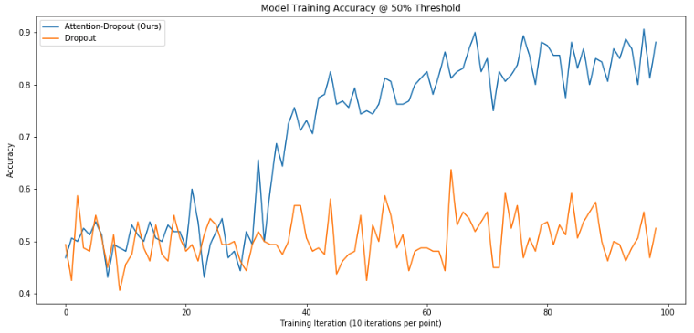

# Layer-Specific Dropout with Attention
Brennan Gebotys

# Introduction

## Self-Attention

The Transformer [2] has led to significant advances in NLP tasks.

One significant downfall of the Transformer's attention is interpretability. Given n-words, an L-layer Transformer requires analysis of L * n^2 elements. With our technique, only L * n elements are required to be analyzed.  

## Dropout

Dropout [3] is a regularization technique where units are dropped stochastically with a P(drop) at training time. Since we are comparing Dropout techniques, we will refer to this technique as Vanilla Dropout.

A disadvantage of Vanilla Dropout is that units are randomly dropped. When training word-embeddings, by dropping only certain units of whole embeddings, Vanilla Dropout can lead to a significant loss of latent-space information. We show this loss in latent-space information can significantly hinder training larger models. 

## The Model

We will show that the purposed mechanism improves interpretability, time to train, training larger models, and acts as a valid regularization technique. The mechanism is easy to implement, requires a small amount of extra trainable parameters, and shows significant improvements on the tested dataset. 

# Algorithm

Assume the input is of a single batch of size (*sequence_length*, *hidden*). Each vector across the sequence length will be referred to as a word-vector. The algorithm would act the same with batch sizes greater than one.

Each layer in the network will have a unique corresponding vector (initialized randomly) of size *hidden*. This vector will be called the layer-vector. 

Vector dot-product will be performed with the layer-vector and each word-vector. This operation will result in a vector of size (*sequence_length*, 1). This vector will be called the attention-vector. 

Each value in the attention-vector will correspond to how relevant the corresponding word-vector is to the current layer. 

Using the attention-vector we create a probability distribution to stochastically sample the least relevant word-vectors from. 

Let P(i) be the probability of setting all the units at index i of the sequence to zero. 

P(i) = max(attention-vector) - *attention-vector[i]*

To satisfy the probability axioms we apply the softmax function across P(i). We then sample `max(1, sequence_length * dropout_rate)` indices, and set the corresponding word-vectors to zero.

# Setup 

The dataset used was the Large Movie Review Dataset [1]. The Transformer model [2] was used since it has shown great results in previous NLP tasks. The Dropout Attention layers were included after the Multihead-Attention and Feedforward layers. The only difference between the two models is the type of Dropout applied to intermediate layers. Hyperparameters and model size between the two models were kept the same.

# Results

## 6-Layer Transformer (1 Epoch - Full Dataset)
> Test Accuracy  
> Attention Dropout: 0.8494  
> Vanilla Dropout: 0.8354 

### Training
 
### Validation

## 12-Layer Transformer (1 Epoch - Full Dataset)
> Test Accuracy:  
> Attention Dropout:    0.8489  
> Vanilla Dropout:              0.4865 

### Training

### Validation

## 1-Layer Transformer (1 Epoch - 5K Subset)
> Test Accuracy:  
> Attention Dropout: 0.6704  
> Vanilla Dropout: 0.5759 

For more results please see the notebook, `IMBD-BERT Attention Dropout Analysis.ipynb`.

# Analysis

### 6-Layer Transformer
We see that the model which uses Attention Dropout achieves a higher test accuracy. 

We also see that it's training accuracy spikes ~100 iterations sooner than the model with Vanilla Dropout. This supports the hypothesis that Attention Dropout allows models to learn faster since each layer is able to ignore non-important word-vectors. 

We also see from the validation graph that the algorithm is an equal regularization technique to Dropout.

### 12-Layer Transformer
Doubling the number of layers, we see that the model which uses Attention Dropout is still able to learn while the model which uses Vanilla Dropout is unable to learn. This supports the hypothesis that Attention Dropout maintains latent-space information better than Vanilla Dropout allowing larger models to learn better. 

### 1-Layer Transformer - 5K Subset
To test the hypothesis that Attention Dropout allows models to learn faster we trained on a 5K subset of the training data for one epoch. We see that the model which uses Attention Dropout achieves test-accuracy 10% better than the model which uses Vanilla Dropout. 

# Future Research

The general idea of the technique is very easy to implement and can be applied across many different areas including computer vision, skip-connections, layer-to-layer attention and more. Though only dropout attention is investigated in this project, other variations may be investigated in future research.

# References

[1] Andrew L. Maas, Raymond E. Daly, Peter T. Pham, Dan Huang, Andrew Y. Ng, and Christopher Potts. (2011). Learning Word Vectors for Sentiment Analysis. The 49th Annual Meeting of the Association for Computational Linguistics (ACL 2011). 

[2] Ashish Vaswani, Noam Shazeer, Niki Parmar, Jakob Uszkoreit, Llion Jones, Aidan N Gomez, Lukasz Kaiser, and Illia Polosukhin. 2017. Attention is all you need. In Advances in Neural Information Processing Systems, pages 6000–6010.

[3] Srivastava, Nitish, et al. "Dropout: a simple way to prevent neural networks from overfitting." The Journal of Machine Learning Research 15.1 (2014): 1929-1958.
